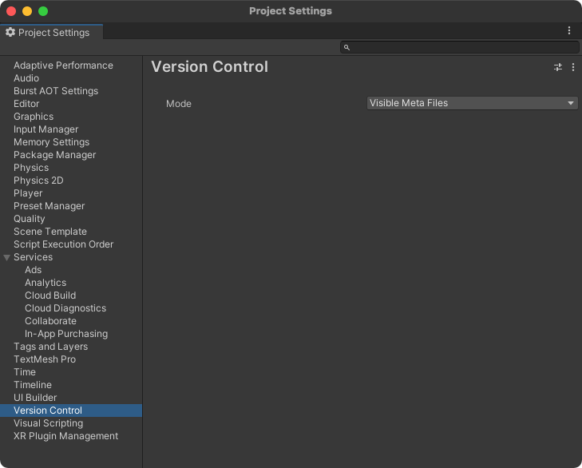
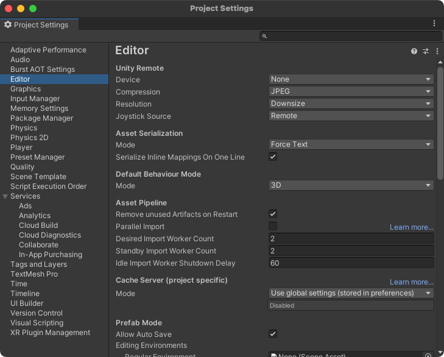
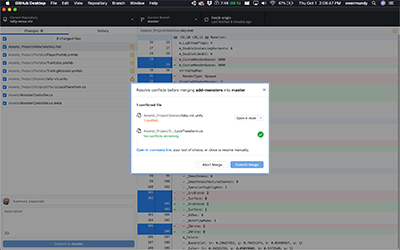
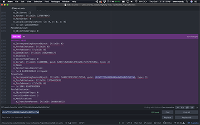

<!-- paginate: true -->

[<](../README.md)


# Unity + Git


<!--
Presentation comments ...
-->


---

## Introduction

- Git is a free and open source distributed version control system.
- GitHub is the place to share code (repositories) with friends, co-workers, classmates.
- Git can be used with any language or code environment, and works great with Unity.


---

## Setup a Unity Project for Git

Start here: [Git & Github Desktop](https://docs.google.com/presentation/d/1vtK6LoqwF4rQQZZy-ovuEgsYUwwMRXsqDVMOjAPSBt0/edit#slide=id.g9125938793_0_11). Then, review the steps below to setup Unity + Git.

Skip 1-4 if you [fork](https://docs.google.com/presentation/d/1vtK6LoqwF4rQQZZy-ovuEgsYUwwMRXsqDVMOjAPSBt0/edit#slide=id.gad119073e1_0_6) any of the class [dig250-unity-* projects](https://github.com/omundy?tab=repositories&q=unity&type=&language=&sort=)

1. [Create a new Unity project](#1-create-a-new-unity-project)
1. [Track Unity project with Git](#2-track-unity-project-with-git)
1. [Basic Unity + Git setup](#3-basic-unity--git-setup)
1. [First commit and push the project to Github](#4-first-commit-and-push-the-project-to-github)
1. [Set up Unity and Git for a team](#5-set-up-unity-and-git-for-a-team)
1. [Team workflow tips](#6-team-workflow-tips)
1. [Dealing with issues](#7-dealing-with-issues)
1. [Advanced Setup with SmartMerge](#8-advanced-setup-with-smartmerge)

---


## 1. Create a new Unity project

1. In Unity Hub, click "New Project"
1. Select a template, name and location. These instructions will use the example name `dig250-final-project` and location `/Users/username/Documents/Github/`
   - Note: [Don't save git repositories, Unity projects, and other app files in cloud-synced folders](https://github.com/omundy/dig250-game-art-dev/blob/master/reference-sheets/Unity-Git.md)
1. Unity will add a new project folder to your computer.


---

## 2. Track Unity project with Git

1. Find the project folder in Finder or Explorer. Click the dots and "Reveal in ..."
2. <a href="../assets/img/git-setup-drag-github.png">Drag the folder into Github Desktop. </a>
3. Since it isn't yet, Github will prompt you to "create a repository" there.

<details>
<summary>Manual option to track Unity project with Git 🐢</summary>

1. Use Terminal to `cd` into the Unity project folder: `cd ~/Documents/dig250-final-project`. Confirm you are in the project **root directory** and can see project folders like **Assets**: `ls -la`
2. [Initialize the directory as a new Git repository](https://docs.google.com/presentation/d/1vtK6LoqwF4rQQZZy-ovuEgsYUwwMRXsqDVMOjAPSBt0/edit#slide=id.ga9a9dc793f_0_0): `git init`
3. In Github Desktop, choose File > Add Local Repository and select the project folder. (Alternately, add the project with [Github Command Line Tool](https://docs.github.com/en/desktop/installing-and-configuring-github-desktop/launching-github-desktop-from-the-command-line): `github .`)

</details>


---

## 3. Basic Unity + Git setup

1. Add a Unity-specific `.gitignore` file to the project root:
    - [This version](https://www.gitignore.io/api/unity,macos,windows) also includes OS-specific ignore content.
    - [This one](https://github.com/github/gitignore/blob/master/Unity.gitignore) is also [recommended](https://thoughtbot.com/blog/how-to-git-with-unity).
    - Do not let your OS append `.txt` to the end of the file name.
    - You will know the `.gitignore` works if you cannot not see the `/Library/` directory in Github Desktop > Changes.
1. Unity Settings
	1. Use visible `.meta` files: In Unity Project Settings > Version Control, set Mode = "Visible Meta Files"
	2. Force assets to save as plain text: In Unity Project Settings > Editor > Asset Serialization, set Mode = "Force Text"
1. Install [Git LFS](https://adamwreed93.medium.com/how-to-set-up-git-lfs-into-your-unity-project-9fd276305fe7) (Large File Storage)
	1. Install Git LFS `brew install git-lfs` (Mac version, requires [Homebrew](https://brew.sh/)) (more [instructions](https://git-lfs.com/))
	2. Change to your project directory and initialize `git lfs install`
	3. Add a [`.gitattributes`](https://gist.github.com/FullStackForger/fe2b3da81e60337757fe82d74ebf7d7a) file to make sure Unity and Git LFS work correctly

<a href="../assets/img/git-setup-visible-meta-files.png"></a>
<a href="../assets/img/git-setup-asset-serialization.png"></a>


---

## 4. First commit and push the project to Github

In Github Desktop:

1. Add a message and create your first commit.
1. Push to publish the repository online. Make it public for now.


---

## 5. Set up Unity and Git for a team

1. One team member should:
    1. Create the project with Git using the above instructions
    1. Add team members as "collaborators" in github.com repository Settings > Manage Access
2. Then everyone in the team should:
    1. Ensure Unity, Git, and Github Desktop is installed on their computers
    1. Have a [Github account](https://github.com/)
    1. Clone the team project:
        1. Go to your team repo page on github.com
        1. Click Code > Open with Github Desktop
    1. Confirm setup:
        1. Add or edit a test file in the project
        1. Commit your change and push to the repo.
        1. Everyone else, pull the changes.


---

## 6. Team workflow tips

- Communicate often with your teammates; establish rules at the beginning.
- Commit your work often, using descriptive names for the commits and branches for your work.
- Work in separate branches - this ensures you don’t pollute the `main` branch.
- Work in separate scenes - YAML files are not pretty, readable, or organized 🙄 When you do work in the same scene avoid reorganizing assets. 
- Use prefabs as much as possible to [prevent scene conflicts](https://medium.com/helloiconic/5-must-read-tips-to-use-git-with-unity-e8a308aa83a4).
- More tips: http://madwomb.com/tutorials/GameDesign_UnityGithub.html


---

## 7. Dealing with issues
- Clear caches (local package cache, [global package cache](https://docs.unity3d.com/Manual/upm-cache.html)) in case of corrupted packages, and let Unity rebuild them the next time it resolves your dependencies.
- Clear the Library folder
- Delete your project's cache, located at <project path>/Library/PackageCache, to force the Package Manager to rebuild the caches and re-install them in your project.


---

## 8. Advanced Setup with SmartMerge

SmartMerge allows for more control over scene merging

1. Enable SmartMerge to handle merging of scenes ([see below](#setup-smartmerge))


### Setup SmartMerge

Unity comes with its own UnityYAMLMerge tool to make scene merges with Git go smoothly.

- Unity Manual: [SmartMerge](https://docs.unity3d.com/Manual/SmartMerge.html)
- [anacat/unity-mergetool](https://github.com/anacat/unity-mergetool)

#### Mac instructions

- Assumes you have Git, Unity Hub, Unity <version> installed and have followed the setup instructions above
- Windows-specific paths can be found [here](https://github.com/anacat/unity-mergetool)

```bash
# Download a fallback merge tool, for example diffmerge
brew cask install diffmerge

# edit .git/config file
nano .git/config

# ... and link to merge tool

[merge]
        tool = unityyamlmerge
[mergetool "unityyamlmerge"]
        trustExitCode = false
        cmd = '/Applications/Unity/Hub/Editor/2020.1.2f1/Unity.app/Contents/Tools/UnityYAMLMerge' merge -p "$BASE" "$REMOTE" "$LOCAL" "$MERGED"
```

Now, whenever you merge or rebase and a conflict appears, instead of manually fixing, open Git Shell/Bash and type the following command:
```bash
git mergetool
```
The tool will then resolve those conflicts for you automatically. If you don't have a fallback tool, you'll just get a message stating this, but you'll still be able to resolve the conflitcs in your editor. Then to run `git add .` in order to save the changes made, and then `git rebase --continue` when rebasing or `git merge --continue` when merging.


---

#### You can also do this with Github Desktop / Atom

1. Switch into the branch and test that everything works
1. Switch back to master branch and choose Branch > Merge into current branch ...
1. Select the branch you want and SmartMerge should take care of everything
1. If SmartMerge finds issues it will [prompt](../assets/img/git-resolve-yaml-desktop.png) you to open the default editor used to resolve the conflicts (in my case, Atom).
1. Open each file in [Atom and scroll to select which conflicting text to keep]((../assets/img/git-resolve-yaml-atom.png))
1. Choose [Commit Merge](../assets/img/git-resolve-yaml-desktop.png) when finished

[](../assets/img/git-resolve-yaml-desktop.png)
[](../assets/img/git-resolve-yaml-atom.png)


---

#### Alt. method: Perforce

(Perforce, which provides more automation but looks like a serious pain to set up)

- [Unity Forum thread](https://forum.unity.com/threads/smart-merge-not-working.315903/) (dead?) and [Reddit Thread](https://www.reddit.com/r/Unity3D/comments/39bdq5/how_to_solve_scene_conflicts_with_unitys_smart/)
- The [Perforce installation instructions](https://www.perforce.com/video-tutorials/vcs/installing-and-configuring-p4connect-unity) mention "P4Connect" connect on the asset store
but it [does not exist](https://assetstore.unity.com/?q=P4Connect&orderBy=1)
- Perforce and P4V seem extra complicated to setup, with the only benefit a GUI to complete the merging. They are available on homebrew using `brew cask install p4v` and `brew cask install perforce`


---

## Videos

- Unity+Git
	- Infallible Code [How to Setup a Git Repository for a Unity Project](https://www.youtube.com/watch?v=_ewoEQFEURg) (13:55) (2022)
	- Brackeys [How to use GitHub with Unity](https://www.youtube.com/watch?v=qpXxcvS-g3g) (7:26) (2017)
- Git+Github


---

## References

- [Unity Collaboration and Version Control](https://docs.google.com/presentation/d/1phoKp9d7BjhM0scs78rim6DtcUGoJAy4L31eDrR3zGE/edit#slide=id.g9b165dbc7b_0_0)
- [Github Cheatsheet](https://github.github.com/training-kit/downloads/github-git-cheat-sheet.pdf) and [Github Markdown Cheatsheet](https://guides.github.com/pdfs/markdown-cheatsheet-online.pdf)
- [Unity Best Practices](https://github.com/jaayap/Unity_Best_Practices/blob/master/En/Versioning.md/#versioning--git--unity)
- Github Documentation: [Installing Git Large File Storage
](https://docs.github.com/en/free-pro-team@latest/github/managing-large-files/installing-git-large-file-storage)
- [How to Git with Unity](https://thoughtbot.com/blog/how-to-git-with-unity)
- [SO: How to use Git for Unity3D source control?](https://stackoverflow.com/questions/18225126/how-to-use-git-for-unity3d-source-control)
