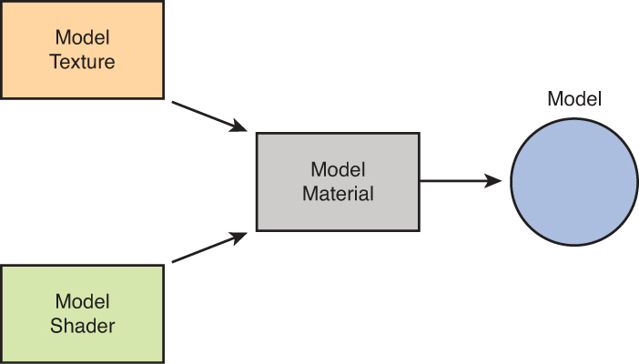

## Reference Sheet - Graphics > 3D Objects

3D rendering in Unity uses Meshes, Materials, Shaders and Textures. These assets have a close relationship, and are often encapsulated in a single model.

A material contains properties and textures, and shaders dictate what properties and textures a material can have.

### Terminology

Term | Definition
--- | ---
Model | A package containing the mesh, materials, shaders, textures, and optionally, animations and skeleton (animation rig) for a 3D character or object.
Mesh | The main graphics primitive of Unity that defines the **shape** of an object.
[Mesh Renderer](https://docs.unity3d.com/Manual/class-MeshRenderer.html) | The component that displays the geometry and material of a 3D game object.
Material | Defines **how** a surface should be rendered. Using options defined in the shader,  referenced textures and their tiling settings, and lighting in the scene, a material controls what the surface looks like, including its color tint and how shiny or smooth it appears.
Shader | Small scripts that contain mathematical calculations and algorithms for calculating the color of each pixel rendered, based on the lighting and the material configuration.
[Texture](https://docs.unity3d.com/Manual/Textures.html) | Any bitmap image in Unity that, when placed on a [Material](https://docs.unity3d.com/Manual/Materials.html) and attached to a 3D object. Represent **what** is on a material’s surface.

### Sources
* [Unity Manual](https://docs.unity3d.com/Manual/index.html) and [Unity Scripting Reference](https://docs.unity3d.com/ScriptReference/index.html)
* Chapter 2 in Hocking, Joseph. Unity in Action: Multiplatform Game Development in C # (2nd Edition). Manning, 2018.
* [Working with Models, Materials, and Textures in Unity Game Development](https://www.informit.com/articles/article.aspx?p=2162089&seqNum=2)
