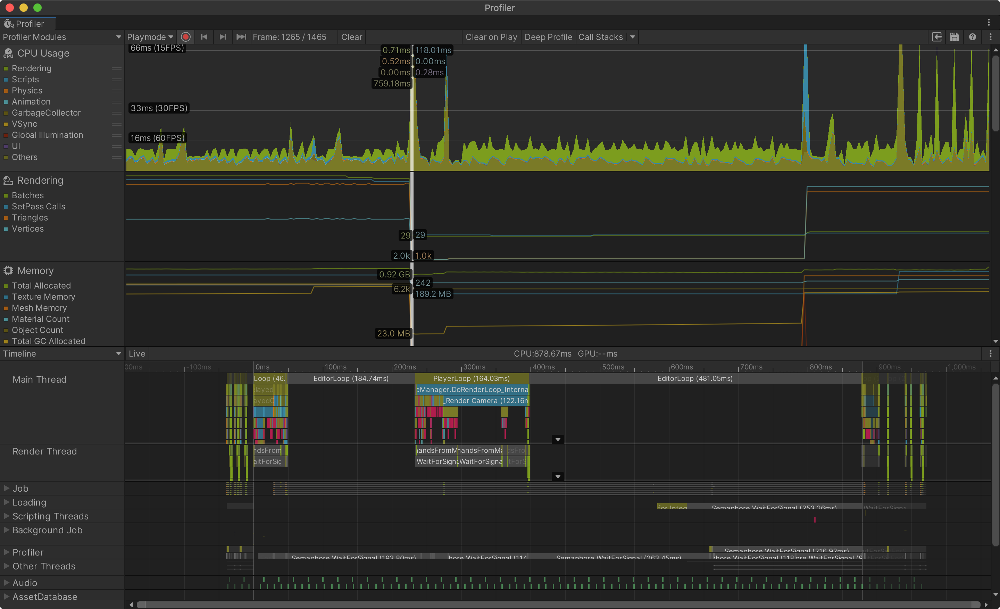
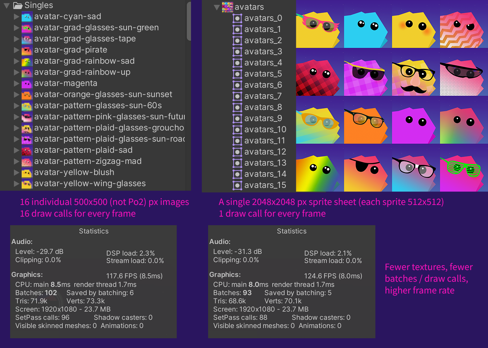

# Unity Performance

See the sample project here: https://github.com/omundy/dig250-unity-performance

## Frame Per Second (FPS)

- To increase your game's performance, simply lessen the work of the CPU, GPU, memory, and network.
- The most important metric of a performant game is a high Frames Per Second (FPS) rate, accessed in the Stats window (Game View).
- A frame rate of 60 FPS is optimal. Anything less than 30 FPS will cause noticeable stutter.

## Reduce, Reuse, and Recycle

Many performance gains can come from reducing and reusing CPU or memory.

- When you need a reference to a component, camera, or script, do so in `Awake()` or `Start()` and store the reference in a variable accessible by the entire class.
- This improves performance because your script won't have to look up the same reference over and over in `Update()`.

### Garbage Collection

- When you remove (`Destroy`) objects from your game their data is no longer needed.
- The memory set aside to store that data, "Garbage", must be freed before it can be reused.
- Garbage Collection is the process that makes previously used memory available again.
- It can cause big performance problems (a frame rate stutter) if not properly handled.

### Object Pooling

- A pattern to decrease garbage collection (and stutter) created by adding and removing objects from memory.
- Start by pre-instantiating objects you need at any specific moment *before* the scene starts.
- Place the objects off-camera in a "pool" so they are in memory, but the CPU/GPU doesn't have to draw them.
- When you need an object, pull it from the pool. Once finished with it, don't destroy it (which causes garbage collection), rather put it back in the pool to reuse later.
- See more about [Object Pooling in Unity](https://www.raywenderlich.com/847-object-pooling-in-unity)

### Strings increase garbage

In Unity, retrieving strings from game Objects will create a duplicate of the string, which will need to be garbage collected. Some ways to save memory:

- Don't use `gameObject.tag == "string"`; Using `CompareTag(string)` instead does not add to the heap resulting in a ~27% increase in performance. See: Unity 5 Game Optimization by Chris Dickinson and [Unity forum](https://answers.unity.com/questions/200820/is-comparetag-better-than-gameobjecttag-performanc.html)
- Don't concat strings in loops or `Update()`. See: Unity Manual: [Understanding Automatic Memory Management](https://docs.unity3d.com/Manual/performance-garbage-collection-best-practices.html)

### More on Garbage Collection

- Daniel Ilett [Unity Tips: Garbage Collection](https://danielilett.com/2019-08-05-unity-tips-1-garbage-collection/), 2019
- Unity Manual: [Garbage collection best practices](https://docs.unity3d.com/Manual/performance-garbage-collection-best-practices.html)
- Unity Tutorial: [Fixing Performance Problems](https://learn.unity.com/tutorial/fixing-performance-problems-2019-3-1)

## The Profiler

- [Regularly check](https://www.youtube.com/watch?v=fROTtgZK-Zs) the [Profiler Window](https://docs.unity3d.com/Manual/ProfilerWindow.html) to identify obvious dips in performance.
- Since changes in one "performance area" can affect others, test everything as you make each improvement.

## Graphics Performance

### Draw calls

- A draw call is the command the CPU sends to your GPU to draw geometry on your screen
- Effectively, the number of objects being drawn.
- Keep this number down (<2000 desktop and <200 mobile) to maintain good performance.

### How to lower your draw calls

- Use [spritesheets (a.k.a. texture atlas) to group similar bitmap images](../assets/img/performance-draw-calls-sprite-sheet.png) and reduce the draw calls to your GPU
- Use pixel resolutions that are Power of 2 (128,256,512,1024, etc.) which can be compressed better.

### More on Graphics Performance

- Unity Manual: [Mobile Optimization](https://docs.unity3d.com/Manual/MobileOptimisation.html)
- Unity Manual: [Optimizing graphics performance](https://docs.unity3d.com/Manual/OptimizingGraphicsPerformance.html)
- [Unity CPU Optimization: Is Your Game… Draw Call Bound?](https://www.gamasutra.com/blogs/RubenTorresBonet/20200513/362872/Unity_CPU_Optimization_Is_Your_Game_Draw_Call_Bound.php) (2020)

## Networks, Bandwidth, and Handling Data

- [5 Common Misuses of Collections](https://www.jacksondunstan.com/articles/5145)

## Optimizing Unity UI

If you have a lot of UI in your game start with this video Unite Europe 2017: [Squeezing Unity: Tips for raising performance
](https://www.youtube.com/watch?v=_wxitgdx-UI&index=7&list=PLX2vGYjWbI0Rzo8D-vUCFVb_hHGxXWd9j&ab_channel=Unity)

- From the video, the first thing to know is that during runtime, if you [change even one component that needs to be redrawn it sets a "dirty" flag on the entire Canvas (the first parent technically) of that changed object](https://youtu.be/_wxitgdx-UI?t=1648).
- When a Canvas is marked dirty then **ALL** the geometries in that Canvas need to be recomputed [on that frame](https://docs.unity3d.com/Manual/ExecutionOrder.html) causing a major performance hit. Several of the tips below help to address this issue.

### More UI Tips

- Organize your UI elements into multiple or nested canvases based on when they are updated. These "islands" will [help to isolate elements into groups that should be redrawn together](https://youtu.be/_wxitgdx-UI?t=1680) so you won't have to redraw all elements across your UI.
- Use prefabs to nest elements [#20](https://medium.com/@dariarodionovano/unity-ui-best-practices-40964a7a9aba)
- [Disable the Raycast Target property for all non-interactive elements](https://medium.com/@dariarodionovano/unity-ui-best-practices-40964a7a9aba) to avoid [the amount of work the raycaster must do on each frame](https://youtu.be/_wxitgdx-UI?t=1944)
- Turn off Images components you don't need to avoid draw calls [#15](https://medium.com/@dariarodionovano/unity-ui-best-practices-40964a7a9aba)
- [Do not use alpha to show / hide elements](https://medium.com/@dariarodionovano/unity-ui-best-practices-40964a7a9aba)
- Be careful using `Canvas.ForceUpdateCanvases()` because there is a serious performance hit.
- How to hide a Canvas [Disable the Canvas Component itself](https://create.unity.com/Unity-UI-optimization-tips)

### UI performance resources

- Unity Tutorial: [Optimizing Unity UI](https://learn.unity.com/tutorial/optimizing-unity-ui#5c7f8528edbc2a002053b5a0)
- Unity Create: [Some of the best optimization tips for Unity UI](https://create.unity3d.com/Unity-UI-optimization-tips)
- [Unity UI Best Practices](https://medium.com/@dariarodionovano/unity-ui-best-practices-40964a7a9aba)

## Static vs Dynamic GameObjects

- Marking an object as static (the check box at top right of the Inspector) "can save on runtime calculations, and potentially improve performance." ([Unity](https://docs.unity3d.com/Manual/StaticObjects.html)), depending on things like the overall number and complexity of the objects involved, whether or not you use lighting in your game.
- Keep in mind that this will increase the filesize of your build (and thus memory during play) "Using static batching requires additional memory for storing the combined geometry."

## More Performance Tips

- Know how the camera frustrum and clipping planes work https://docs.unity3d.com/Manual/UnderstandingFrustum.html
- Did you bake lighting?
- Did you bake your fonts ([change from dynamic to static](https://youtu.be/NY1xKqCIj3c?t=849))
- Consider the [Order of Execution for Event Functions](https://docs.unity3d.com/Manual/ExecutionOrder.html) and make sure you aren't causing extra work.

## Editor Performance

General best practices include: 

1. Restart Unity once a while
2. Delete the contents of the project Library (resets package caches and others that Unity rebuilds). Quit Unity, delete contents, then start again.
3. Use Assembly definitions

### (Experimental) Editor Iteration Profiler

https://discussions.unity.com/t/introducing-the-editor-iteration-profiler/794996

### Sources
- [Unity Scripting Reference](https://docs.unity3d.com/ScriptReference/index.html)
- Chapter 8 in Halpern, Jared. Developing 2D Games with Unity. APress, 2019.
- Tomas Macek [The 10 Most Common Mistakes That Unity Developers Make](https://www.toptal.com/unity-unity3d/top-unity-development-mistakes)
