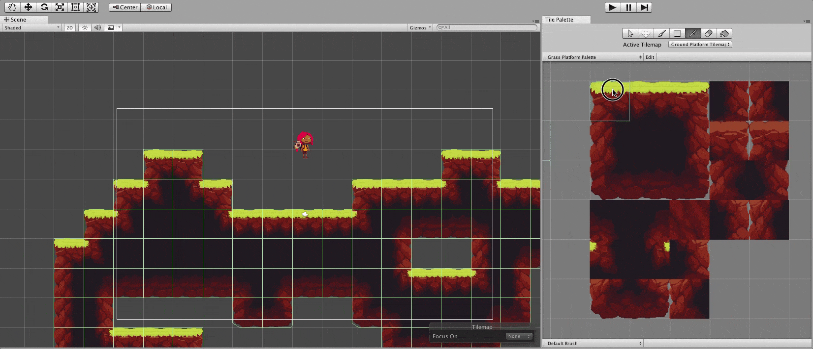

## Reference Sheet - Unity Tilemaps

* Unity Tilemap: [The Basics](https://www.youtube.com/watch?v=fmNtibNWPhc) (3:48)
* Unity Tutorial: [Intro to 2D World building w/ Tilemap](https://unity3d.com/learn/tutorials/topics/2d-game-creation/intro-2d-world-building-w-tilemap) (parts 1–8)

### Terminology

Term | Definition
--- | ---
[Tilemap](https://docs.unity3d.com/Manual/class-Tilemap.html) | A technique in 2D game development consisting of building the game world or level map out of small, regular-shaped images called tiles. This results in performance and memory usage gains — big image files containing entire level maps are not needed, as they are constructed by small images or image fragments multiple times. [MDN](https://developer.mozilla.org/en-US/docs/Games/Techniques/Tilemaps)
Tiles | Assets with sprites that have been segmented or “sliced” into convenient dimensions to be placed in the game over a grid using a Tile Palette.
Grid | A game object that controls the layout of its child tilemaps.
Tilemap Component | Component attached to the tilemap game objects that allow you to 'paint' on them.
[Tile Palette](https://docs.unity3d.com/Manual/Tilemap-Palette.html) | A 'palette' of tiles that you can view using the Tile Palette Window to select tiles to paint over a grid in the scene
[Tilemap Collider](https://docs.unity3d.com/2018.3/Documentation/Manual/Tilemap-Physics2D.html) | Adding this component to a tilemap will generate a collider based on the Tiles of the Tilemap. You can also use the Composite Collider 2D with this collider for performance.
[Activate/Deactivate](https://docs.unity3d.com/Manual/DeactivatingGameObjects.html) | You can activate or deactivate a game object using the editor by 1) uncheck the box next to the game object's name. This disables it and all its components. A second way, that only hides the object, is 2) in the Inspector, uncheck the button next to it's Sprite Renderer (now the image of it will no longer be rendered, though its components are still active).

### Tilemap Workflow

Below is the general workflow to follow to create and paint a Tilemap:

1. Create a Tilemap GameObject
2. Import and prepare Sprites to create Tile Assets
3. Create a Tile Palette with selected Tile Assets
4. ‘Paint’ on the Tilemap with the Tile Assets and Brush Tools available from the Tile Palette
5. If you want the Tilemap to interact with Physics2D, attach the Tilemap Collider component to your Tilemap to generate a Colider based on the Tiles present on the Tilemap.

### Camera Terminology

Term | Definition
--- | ---
[Camera](https://docs.unity3d.com/Manual/CamerasOverview.html) | A game object with a Camera component that renders your players’ view of the game. Can be moved and repositioned (e.g. a "first-person shooter").
Cinemachine | Cinemachine is a controller that can automate all types of camera movements, blend and cut from camera to camera automatically, and add many other cinematic effects.

### Camera Examples

**Camera Projection** 
The camera setting that renders objects with `perspective` intact (lines converge on the horizon) or `orthographic`, which renders objects uniformly, with no sense of perspective. 

**Cinemachine** 
Cinemachine used in a 2D top-down game to follow the player.
Source: [Using Cinemachine in 2D for Unity](https://medium.com/@jaredehalpern/using-cinemachine-in-2d-for-unity-f35dd394326d) by Jared Halpern

### Sources
* Unity Manual: [Tilemaps](https://docs.unity3d.com/Manual/class-Tilemap.html) and [Unity Scripting Reference](https://docs.unity3d.com/ScriptReference/index.html)
* Chapter 8 in Ferro, Lauren S., and Francesco Sapio. Unity 2017 Game Development. Packt, 2018.
* Chapter 4 in Halpern, Jared. Developing 2D Games with Unity. APress, 2019.
